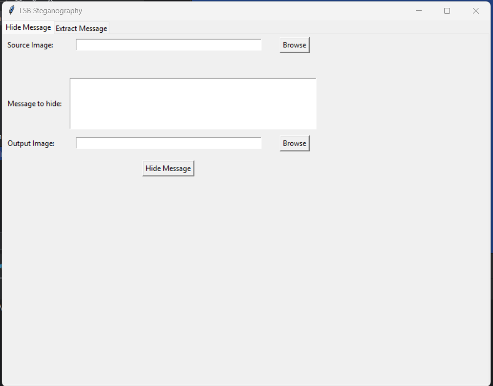

# LSB Steganography Application



Приложение для скрытия и извлечения текстовых сообщений в изображениях с использованием метода LSB (Least Significant Bit).

## Возможности

- **Скрытие сообщений**:
  - Встраивание текста в изображения формата BMP
  - Автоматический расчет максимальной длины сообщения
  - Сохранение результата в новый файл

- **Извлечение сообщений**:
  - Чтение скрытых данных из BMP-изображений
  - Автоматическое определение длины сообщения
  - Защита от чтения поврежденных данных

- **Пользовательский интерфейс**:
  - Две отдельные вкладки для скрытия и извлечения
  - Просмотр загруженных изображений
  - Интуитивно понятное управление

## Требования

- Python 3.7+
- Установленные пакеты:
  - Pillow (`pip install pillow`)
  - Tkinter (обычно входит в стандартную библиотеку Python)

## Установка

1. Клонируйте репозиторий:
```bash
git clone https://github.com/ваш_username/lsb-steganography.git
cd lsb-steganography